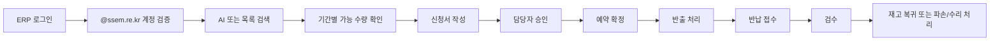

# 교구 관리 홈페이지 개발 방향

## 목표

협회가 보유한 로봇, 센서보드, 전자기기, 브릭, 교재/활동지 교구를 하나의 운영 시스템에서 관리하고, 협회 내부와 외부 회사, 학교, 선생님이 필요한 기간에 대여 신청할 수 있도록 한다.

이 시스템은 단순 목록 사이트가 아니라 교구의 입고, 보유, 예약, 승인, 반출, 반납, 검수, 파손, 수리, 폐기까지 이어지는 생애주기 관리 시스템으로 설계한다.

## 핵심 원칙

1. 실제 대여 가능 수량은 총수량이 아니라 상태와 기간을 반영해 계산한다.
2. AI는 신청 창구와 추천 보조 역할을 맡고, 최종 가능 여부는 DB 계산 결과만 사용한다.
3. 승인 전 예약 선점 정책을 명확히 둔다.
4. ERP 로그인은 상속하되, 교구 시스템 내부 권한은 별도 관리한다.
5. `@ssem.re.kr` 계정만 대여 신청을 제출할 수 있게 한다.
6. 교구 라벨, QR, 반출 확인, 반납 검수를 운영 흐름에 포함한다.
7. 개별 번호가 없는 교구도 운영할 수 있도록 수량형 검수 모델을 기본으로 둔다.

## 사용자 유형

| 역할 | 설명 | 주요 권한 |
| --- | --- | --- |
| 일반 대여자 | 협회, 회사, 학교, 선생님 계정 | 검색, AI 신청, 내 신청 조회 |
| 담당자 | 교구 운영 담당자 | 승인, 반출, 반납, 검수, 일정 조정 |
| 관리자 | 협회 시스템 관리자 | 재고 등록, 권한 관리, 통계, 정책 설정 |
| 감사/조회자 | 운영 현황만 확인하는 사용자 | 대시보드와 이력 조회 |

## 업무 흐름



## 교구 상태 모델

| 상태 | 의미 | 대여 가능 수량 포함 |
| --- | --- | --- |
| 정상 | 대여 가능한 상태 | 포함 |
| 예약됨 | 특정 기간에 선점됨 | 해당 기간 제외 |
| 승인대기 | 정책에 따라 임시 선점 가능 | 설정값에 따름 |
| 대여중 | 이미 반출됨 | 해당 기간 제외 |
| 반납대기 | 반출 후 반납 예정 | 제외 |
| 검수중 | 반납되었으나 상태 미확정 | 제외 |
| 파손 | 대여 불가 | 제외 |
| 분실 | 대여 불가 | 제외 |
| 수리중 | 대여 불가 | 제외 |
| 대여불가 | 내부용/구형/세트화 불가 | 제외 |

## 번호 없는 교구 운영 정책

현재 교구 상당수는 개별 번호가 붙어 있지 않으므로 “R14-003번 지니봇 파손”처럼 추적하기 어렵다. 따라서 MVP에서는 다음 방식을 기본으로 한다.

| 단계 | 처리 방식 |
| --- | --- |
| 반출 | 품목과 수량을 기준으로 정상 수량이 나간 것으로 기록 |
| 반납 접수 | 반출 수량과 실제 반납 수량을 비교 |
| 반납 검수 | 정상, 파손, 수리필요, 분실 수량을 나누어 입력 |
| 재고 반영 | 정상 수량만 대여 가능 재고로 복귀 |
| 불량 반영 | 파손/수리/분실 수량은 대여 가능 수량에서 제외 |
| 이력 관리 | 어떤 기관의 어떤 반출 묶음에서 불량이 발생했는지 기록 |

예를 들어 지니봇 80대를 정상 반출했지만 반납 시 77대 정상, 2대 파손, 1대 충전 불량이면 시스템에는 다음처럼 남긴다.

```text
반출: 지니봇 80대 정상
반납 검수: 정상 77대, 파손 2대, 수리필요 1대, 분실 0대
재고 복귀: 정상 77대
대여 제외: 3대
```

나중에 QR 라벨 작업이 완료된 품목은 개별 번호형으로 전환하고, 번호가 없는 품목은 계속 수량형으로 운영한다. 품목별 추적 방식은 `quantity`, `asset`, `hybrid` 중 하나로 관리한다.

## 대여 가능 수량 계산

```text
대여가능수량 =
  총 보유수량
  - 상시 대여불가수량
  - 반납 검수에서 발생한 파손/분실/수리중 수량
  - 파손/분실/수리중/검수중 수량
  - 신청 기간과 겹치는 확정 예약 수량
  - 신청 기간과 겹치는 대여중 수량
  - 승인대기 선점 정책 적용 수량
```

날짜 겹침 조건:

```sql
start_date <= requested_end_date
AND end_date >= requested_start_date
```

## MVP 범위

1. ERP 계정 연동 인터페이스 정의
2. 교구 마스터 등록과 목록 조회
3. 기간별 대여 가능 수량 조회
4. AI 대여 신청 초안 생성
5. 담당자 승인/반려
6. 예약 확정
7. 반출/반납 상태 관리
8. 운영 대시보드

## 2차 개발 범위

1. QR/바코드 라벨 출력
2. 모바일 반출/반납 스캔
3. 파손 사진 첨부와 수리 티켓
4. 이메일/문자/카카오 알림
5. 수업 목적별 교구 패키지 추천
6. 교구별 사용률, 연체율, 파손율 통계
7. PDF/엑셀 교구 목록 일괄 업로드

## ERP 로그인 연동 방향

현재 `http://101.79.21.9/erp`를 상속한다고 했으므로 다음 중 하나를 선택한다.

| 방식 | 설명 | 추천도 |
| --- | --- | --- |
| ERP SSO 토큰 | ERP 로그인 후 교구 시스템에 signed token 전달 | 높음 |
| ERP 인증 API | 교구 시스템이 ERP에 세션/토큰 검증 요청 | 높음 |
| 동일 도메인 쿠키 공유 | 같은 도메인 아래 배치하고 쿠키 공유 | 중간 |
| 별도 계정 복제 | ERP 사용자 DB를 주기 동기화 | 낮음 |

운영 추천안은 ERP가 사용자 식별값, 이메일, 이름, 부서/기관, 권한 후보를 담은 짧은 수명의 토큰을 발급하고 교구 시스템이 이를 검증하는 방식이다.

## 권장 기술 구조

| 영역 | 추천 |
| --- | --- |
| Frontend | React/Next.js 또는 Vue/Nuxt |
| Backend | NestJS 또는 Spring Boot |
| DB | PostgreSQL |
| 검색 | PostgreSQL Full Text Search + pgvector |
| AI | Gemini API 또는 OpenAI API의 tool/function calling 구조 |
| 파일 | S3 호환 스토리지 또는 서버 파일 저장 |
| 알림 | 이메일 우선, 이후 문자/카카오 확장 |
| 배포 | ERP와 같은 네트워크 또는 VPN 접근 가능한 서버 |

현재 로컬 초안은 외부 패키지 없이 Node.js 기본 서버로 구현되어 있으며, 추후 운영 기술 스택으로 옮기기 쉽게 API 경계와 DB 스키마를 분리했다.
