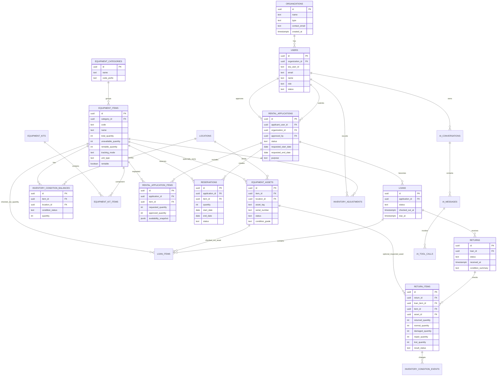

# DB 구조와 ERD 초안

## 설계 기준

교구는 수량으로만 관리하면 부족하다. 햄스터S처럼 대량 보유하는 품목, 태블릿처럼 개별 장비 관리가 필요한 품목, 브릭처럼 세트화가 필요한 품목, 교재처럼 소모성에 가까운 품목이 섞여 있기 때문이다.

따라서 DB는 다음 네 층으로 나눈다.

| 층 | 테이블 | 설명 |
| --- | --- | --- |
| 사용자/기관 | users, organizations | ERP 사용자와 대여 기관 |
| 교구 기준 정보 | equipment_items, categories, locations | 품목, 분류, 보관 위치 |
| 실제 재고 | inventory_condition_balances, equipment_assets, kits, adjustments | 수량형 상태 재고, 개별 자산, 세트, 재고 조정 |
| 대여 운영 | rental_applications, reservations, loans, returns | 신청, 예약, 반출, 반납 |

## 주요 테이블

### users

ERP 로그인 사용자 정보를 교구 시스템에 캐싱한다.

- `erp_user_id`: ERP 사용자 식별값
- `email`: `@ssem.re.kr` 검증 대상
- `role`: applicant, staff, admin, auditor
- `status`: active, suspended

현재 실행용 PostgreSQL 스키마에서는 운영 MVP에 맞춰 `equipment_members`, `equipment_organizations` 테이블로 구현한다. ERP/Supabase 로그인 신원은 `equipment_members.erp_user_id`, `email`에 연결하고, 교구 시스템 권한과 상태는 별도 관리한다.

운영 인증 모드에서는 Supabase Auth 세션을 검증한 뒤 `erp_user_id` 또는 `email`로 기존 회원을 찾는다. 로그인 사용자의 Supabase access token으로 ERP `users.is_super_admin`과 `memberships.job_role`을 읽어 `role/status`를 자동 동기화한다. ERP 등록 사용자는 `active`가 되며, 슈퍼관리자/대표/회사관리자는 `admin`, 회계 담당자는 `auditor`, 일반 직원은 `applicant`로 매핑한다. 단, 교구 관리자가 `suspended` 또는 `archived`로 막은 회원은 자동 활성화하지 않는다.

### equipment_members

- `erp_user_id`: ERP 또는 Supabase 사용자 식별자
- `email`: `@ssem.re.kr` 회원 이메일
- `role`: applicant, staff, admin, auditor
- `status`: active, pending, suspended, archived
- `organization_id`: 교구 운영 기준 소속 기관
- `memo`: 권한 부여 사유와 운영 메모

### equipment_organizations

- `name`: 기관명
- `type`: association, school, company, individual_teacher, partner, other
- `status`: active, inactive
- `manager_email`: 기관 담당자 이메일
- `contact_email`: 대표 연락 이메일

### organizations

협회, 회사, 학교, 선생님 소속을 관리한다.

- `type`: association, company, school, individual_teacher
- `name`: 기관명
- `manager_user_id`: 담당 사용자

### equipment_items

품목 마스터다.

- `code`: R01, S01, E01 같은 품목 코드
- `name`: 햄스터S 등 품목명
- `category_id`: 로봇, 부속품, 센서보드, 전자기기, 브릭, 교재
- `total_quantity`: 전체 보유 수량
- `unavailable_quantity`: 대여불가/파손/분실/수리 등 상시 제외 수량
- `rentable_quantity`: 운영상 대여 가능 기준 수량
- `unit_type`: serialized, quantity, kit, bulk, book
- `rentable`: 대여 가능 여부

### inventory_condition_balances

개별 번호가 없는 교구를 위한 상태별 수량 재고다.

- `condition_status`: normal, damaged, needs_repair, lost, inspecting, unavailable
- `quantity`: 해당 상태의 수량
- `location_id`: 창고/사무국/외부 보관 위치

정상 반납 수량은 `normal`로 돌아오고, 반납 검수에서 불량으로 확인된 수량은 `damaged` 또는 `needs_repair`로 이동한다.

### equipment_assets

QR 라벨이 붙는 실제 장비다. 모든 품목에 필수로 만들지 않는다. 대량 품목은 필요 수량만 자산화하고 나머지는 수량형으로 둘 수 있다.

- `asset_tag`: QR/바코드 값
- `item_id`: 품목
- `status`: available, reserved, checked_out, inspecting, damaged, lost, repairing, unavailable
- `condition_grade`: A, B, C, unusable

### rental_applications

대여 신청의 헤더다.

- `status`: draft, submitted, approved, rejected, canceled, checked_out, returned, closed
- `requested_start_date`
- `requested_end_date`
- `purpose`
- `delivery_method`: pickup, courier, internal_transfer

### rental_application_items

신청 품목 라인이다.

- `item_id`
- `requested_quantity`
- `approved_quantity`
- `availability_snapshot`: 신청 당시 가능 수량 JSON

### reservations

승인 또는 정책에 의해 기간을 선점하는 데이터다.

- `status`: tentative, confirmed, canceled, expired
- `start_date`
- `end_date`
- `quantity`

### loans

실제 반출 건이다.

- `checked_out_at`
- `due_at`
- `checked_out_by`
- `status`: active, partially_returned, returned, overdue

### returns

반납 접수와 검수 결과다.

- `received_at`
- `inspected_by`
- `condition_summary`
- `status`: received, inspecting, completed, disputed

### return_items

번호 없는 교구는 반납 라인 하나에 정상/파손/수리필요/분실 수량을 함께 기록한다.

- `normal_quantity`: 정상 재고로 복귀할 수량
- `damaged_quantity`: 파손으로 대여 제외할 수량
- `repair_quantity`: 수리 필요로 대여 제외할 수량
- `lost_quantity`: 분실 처리할 수량
- `returned_quantity`: 위 네 수량의 합계

## ERD



## 가용 수량 조회 쿼리 예시

```sql
SELECT
  ei.id,
  ei.code,
  ei.name,
  ei.rentable_quantity,
  COALESCE(SUM(r.quantity), 0) AS occupied_quantity,
  GREATEST(ei.rentable_quantity - COALESCE(SUM(r.quantity), 0), 0) AS available_quantity
FROM equipment_items ei
LEFT JOIN reservations r
  ON r.item_id = ei.id
 AND r.status IN ('tentative', 'confirmed')
 AND r.start_date <= :requested_end_date
 AND r.end_date >= :requested_start_date
WHERE ei.rentable = true
  AND ei.code = :item_code
GROUP BY ei.id, ei.code, ei.name, ei.rentable_quantity;
```

반납 검수에서 발생한 불량 수량은 `inventory_condition_balances`와 `inventory_condition_events`에 반영하고, `equipment_items.rentable_quantity`는 정상 재고 기준으로 갱신하거나 조회 시 계산한다.

## 반납 불량 처리 예시

번호 없는 품목은 반납 검수 시 수량을 분해해서 기록한다.

```sql
INSERT INTO return_items (
  return_id,
  loan_item_id,
  item_id,
  returned_quantity,
  normal_quantity,
  damaged_quantity,
  repair_quantity,
  lost_quantity,
  result_status,
  memo
) VALUES (
  :return_id,
  :loan_item_id,
  :item_id,
  80,
  77,
  2,
  1,
  0,
  'mixed',
  '번호 없는 지니봇 묶음 반납. 버튼 불량 2대, 충전 불량 1대.'
);
```

이후 정상 77대는 `normal` 수량으로 복귀하고, 파손 2대와 수리필요 1대는 대여 가능 수량에서 제외한다.

## 운영 정책 테이블 후보

운영 중 바뀔 가능성이 높은 값은 코드가 아니라 정책 테이블로 분리한다.

| 정책 | 예시 |
| --- | --- |
| 승인대기 선점 | 신청 제출 즉시 24시간 tentative 예약 |
| 반납 버퍼 | 반납 후 1일 검수 기간 |
| 최대 대여 기간 | 일반 14일, 협회 내부 30일 |
| 기관별 대여 한도 | 학교 50대, 회사 100대 |
| 품목별 최소 잔여 | 햄스터S 20대는 내부 비상재고 |
