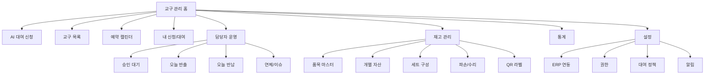

# 화면 메뉴 구조 초안

## 정보 구조

## 일반 대여자 메뉴

| 메뉴 | 주요 화면 요소 |
| --- | --- |
| AI 대여 신청 | 프롬프트, 추천 품목, 기간별 가능 수량, 신청서 초안 |
| 교구 목록 | 분류 필터, 검색, 가능 기간 입력, 상세 보기 |
| 예약 캘린더 | 품목별 점유 일정, 대여 가능 슬롯 |
| 내 신청/대여 | 신청 상태, 승인 결과, 반납 예정일, 담당자 메모 |

## 담당자 메뉴

| 메뉴 | 주요 화면 요소 |
| --- | --- |
| 승인 대기 | 신청자, 기관, 기간, 품목, 가능 수량, 승인/반려 |
| 반출 | QR 스캔, 품목 확인, 반출자, 확인서 |
| 반납 | QR 스캔 또는 수량형 검수, 정상/파손/수리/분실 수량 입력 |
| 예약 조정 | 충돌 신청, 대체 품목, 수량 조정 |
| 이슈 관리 | 파손, 분실, 연체, 수리중 |

## 관리자 메뉴

| 메뉴 | 주요 화면 요소 |
| --- | --- |
| 품목 마스터 | 품목코드, 분류, 수량, 대여 가능 여부, 비고 |
| 개별 자산 | QR, 시리얼, 위치, 상태, 검수 이력 |
| 세트 구성 | 세트명, 구성품, 대체 가능 품목 |
| 정책 설정 | 최대 대여 기간, 승인대기 선점, 반납 버퍼 |
| ERP 연동 | SSO 설정, 사용자 동기화, 권한 매핑 |
| 통계 | 품목별 사용률, 기관별 대여량, 파손율, 연체율 |

## 첫 화면 대시보드

첫 화면은 홍보형 랜딩 페이지가 아니라 담당자와 대여자가 바로 업무에 들어가는 운영 화면으로 구성한다.

| 영역 | 내용 |
| --- | --- |
| 상단 상태 | 로그인 사용자, ERP 연동 상태, 오늘 반출/반납 수 |
| 좌측 메뉴 | AI 신청, 목록, 캘린더, 승인, 반출/반납, 재고 |
| 중앙 | AI 신청 패널 또는 운영 대시보드 |
| 우측 | 오늘의 일정, 승인 대기, 재고 이슈 |

## 모바일 우선 확인 대상

1. 담당자가 창고에서 QR을 찍고 반출 처리할 수 있어야 한다.
2. 선생님이 휴대폰에서 AI 신청과 내 신청 상태를 볼 수 있어야 한다.
3. 표는 모바일에서 카드형 리스트로 전환한다.
4. 승인/반려/반출/반납 버튼은 오작동 방지를 위해 확인 단계를 둔다.

## 번호 없는 교구 반납 화면

개별 번호가 없는 품목은 QR 스캔 없이 다음 필드를 한 화면에서 입력한다.

| 필드 | 설명 |
| --- | --- |
| 품목 | 반출된 품목 |
| 기관 | 대여 기관 또는 사용자 |
| 반출 수량 | 정상 상태로 나간 수량 |
| 정상 반납 | 바로 재대여 가능한 수량 |
| 파손 | 대여 제외, 파손 이력 생성 |
| 수리 필요 | 대여 제외, 수리 티켓 생성 |
| 분실 | 대여 제외, 분실 이력 생성 |
| 검수 메모 | 불량 증상, 사진 첨부, 담당자 메모 |

검수 수량 합계는 반드시 반출 수량과 같아야 하며, 정상 반납 수량만 대여 가능 재고로 돌아간다.
