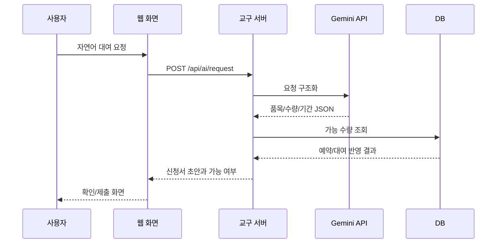

# AI 대여 신청 시나리오 초안

## AI 역할

AI는 사용자의 자연어를 구조화하고, 교구 검색과 가능 수량 조회를 돕는다. 단, AI가 재고를 추측하거나 임의로 승인하지 않는다. 모든 수량과 예약 가능 여부는 시스템 함수 결과만 사용한다.

## 기본 시나리오

### 1. 가능 여부 확인

사용자:

```text
6월 10일부터 14일까지 햄스터S 30대랑 AI카메라 10대 빌릴 수 있어?
```

AI 처리:

1. 품목명 추출: 햄스터S, 햄스터 AI카메라
2. 기간 추출: 2026-06-10 ~ 2026-06-14
3. 수량 추출: 30대, 10대
4. `check_availability` 호출
5. 예약/대여중 데이터를 차감한 가능 수량 표시
6. 신청서 초안 생성

응답:

```text
햄스터S 30대는 가능합니다. AI카메라 10대도 가능합니다.
신청 기간은 2026-06-10부터 2026-06-14까지로 잡겠습니다.
용도와 수령 방법을 확인하면 신청서를 제출할 수 있습니다.
```

### 2. 부족 수량 대체 제안

사용자:

```text
다음 주 수요일부터 금요일까지 초등 AI 수업용 로봇 60대 필요해.
```

AI 처리:

1. 목적 추출: 초등 AI 수업
2. 기간 추출
3. 후보 품목 검색: 햄스터S, 지니봇, 알버트AI, 터틀
4. 가능 수량 비교
5. 부족하면 조합 제안

응답 예:

```text
햄스터S만으로는 60대가 부족합니다. 햄스터S 38대와 지니봇 22대 조합은 가능합니다.
두 품목 모두 초등 AI/로봇 수업에 사용할 수 있습니다.
```

### 3. 신청서 제출

사용자:

```text
그 조합으로 신청해줘. 기관은 새싹초등학교고 담당자는 김교사야.
```

AI 처리:

1. 이전 대화의 추천 조합 확인
2. 기관/담당자 정보 보강
3. 사용자 이메일이 `@ssem.re.kr`인지 검증
4. 신청서 draft 생성
5. 사용자의 최종 제출 확인 요청

## AI 함수 설계

| 함수 | 목적 | 입력 | 출력 |
| --- | --- | --- | --- |
| `get_user_eligibility` | 대여 가능 계정 검증 | user_id, email | eligible, reason |
| `search_equipment` | 품목 검색 | query, category, purpose | item candidates |
| `check_availability` | 기간별 수량 확인 | item_id/code, quantity, start_date, end_date | available_quantity, conflicts |
| `suggest_alternatives` | 대체 품목 추천 | purpose, requested_items, shortage | alternatives |
| `create_application_draft` | 신청서 초안 생성 | applicant, dates, items, purpose | application draft |
| `submit_application` | 신청 제출 | draft_id | submitted application |
| `get_application_status` | 신청 상태 조회 | application_id/user_id | status timeline |

## Gemini 연동 방향

로컬 초안은 서버에서만 Gemini API를 호출한다. 브라우저에 API 키를 노출하지 않는다.



## 시스템 프롬프트 초안

```text
너는 컴퓨팅교사협회 교구 대여 신청을 돕는 운영 보조 AI다.
사용자의 자연어 요청에서 날짜, 품목, 수량, 기관, 담당자, 목적을 추출한다.
재고 가능 여부는 추측하지 말고 반드시 시스템 도구 결과만 사용한다.
@ssem.re.kr 계정이 아닌 사용자는 신청 제출 대상이 아니며 가능 여부 조회만 안내한다.
품목명이 애매하면 후보를 제시하고 확정을 요청한다.
응답은 한국어로, 담당자가 바로 검토할 수 있는 신청서 초안 형태를 포함한다.
```

## 안전 정책

1. AI 응답만으로 예약을 확정하지 않는다.
2. 신청 제출 전에는 사용자 확인을 받는다.
3. 승인 전에는 담당자가 수량과 기간을 조정할 수 있다.
4. 파손/분실/수리중 품목은 추천 대상에서 제외한다.
5. 개인정보와 API 키는 AI 요청에 포함하지 않는다.
6. 운영 로그는 신청 이력과 분리해 보관한다.
7. 번호 없는 교구의 파손 원인을 AI가 특정 자산처럼 단정하지 않는다. “해당 반출 묶음에서 파손 2대 발생”처럼 수량형 사실만 기록한다.

## 반납 검수 AI 보조 시나리오

사용자:

```text
새싹초에서 지니봇 80대 반납했는데 77대 정상, 2대 버튼 파손, 1대 충전 불량이야.
```

AI 처리:

1. 품목 추출: 지니봇
2. 반출/반납 수량 추출: 80대
3. 정상/파손/수리필요 수량 추출: 77/2/1
4. 합계 검증: 77 + 2 + 1 = 80
5. 수량형 반납 검수 초안 생성

응답 예:

```text
지니봇 80대 반납 검수 초안입니다.
정상 77대는 재고로 복귀하고, 파손 2대와 수리필요 1대는 대여 가능 수량에서 제외하겠습니다.
개별 번호가 없는 품목이므로 이력은 새싹초등학교 반출 묶음 기준으로 남깁니다.
```
